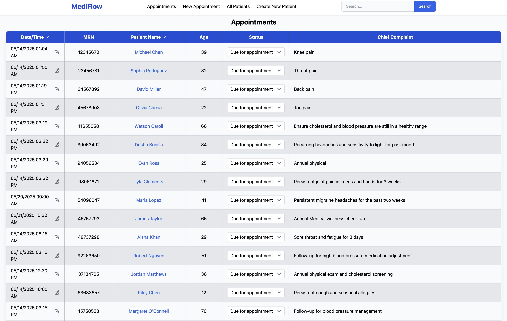

# [🩺 MediFlow](https://mediflow-50oj.onrender.com/appointments)

### Team: Ceina, Jane, Lucila, Marcel

## Overview
Mediflow is an electronic medical records (EMR) platform designed to help doctors and nurses efficiently manage patient information, appointments, and documentation. Built with ease-of-use and intelligent support in mind, MediFlow streamlines the clinical workflow from patient intake to follow-up, all within a centralized interface.

## Features
* 📆 Appointments Dashboard – View and manage daily appointments with quick access to patient visit details.

* 🗂️ Patient Management – Create, edit, and search patient records with auto-generated MRNs and age calculation from D.O.B.

* 📝 In-Visit Documentation – Add real-time consultation notes directly linked to each patient's record.

* 📁 Patient Records Page – Centralized view of medical history, intake notes, and past visits, with filter options.

* 🤖 AI Assistant – Search patient records for keywords to identify trends and recurring concerns instantly.

## Technology Stack
* Frontend:
  * HTML
  * JavaScript
  * Tailwind CSS for utility-first styling
  * Jinja2 templates for dynamic content rendering
  * Flowbite for UI components and modal interactions
* Backend: 
  * Python
  * Flask
  * Flask-WTF for secure form handling and validation
* Database:
  * MongoDB (via Flask-PyMongo)
* Additional Tools:
  * Render for deployment

  
📸 Screenshots

  ### Appointments Feed  
  

  ### All Patient Page  
  

  ### Patient In-Take Page  
  

  ### Patient Record Page  
  

### [Presentation Slides: Click Here](https://docs.google.com/presentation/d/1ltXpc0lqNaMWu5hJcSnQwdfXU4HYhPfcwyYRS9nZNqE/edit#slide=id.g3579f47e1ba_0_0)

### 🚀 Stretch Challenges 
☑️ AI Assistant:
  * Fully implement the AI-powered chatbot for medical insight retrieval

☑️ Authentication:
  * Build and integrate a login page for secure access

☑️ Appointments Feed:
  * Enable sorting by date/time and patient name via clickable chevrons

☑️ All Patients Page:
  * Enable sorting by MRN, first name, and last name using chevrons

☑️ Patient Intake:
  * Save patient notes and intake details to the database
  
☑️ Patient Records: 
  * Add visit records per patient 
  * Implement a documentation section for storing additional patient information

